```{r setup, include=FALSE}
options(htmltools.dir.version = FALSE)
```

background-image: url("img/giphy1.gif")
background-size: 100%
class: inverse, center, middle

# 0. Introduction sur les géographies communales
---
# Code Officiel Géographique (COG)
Le **Code officiel géographique** (COG) est un document de référence publié par l’**Insee** qui rassemble les **codifications (numérotations et libellés) des communes**, des cantons, des arrondissements, des départements, des régions...


Ce code est **révisé annuellement**, en fonction notamment des **fusions et associations** de communes ou de territoires, des **défusions** et des **changements de dénomination**.
---
# Types de modifications communales (1/7)
```{r comment='#', eval=TRUE, echo=F, warning=F, message=F}
library(COGugaison)
trajectoire_commune("76108", 2014,donnees_insee=F)
```
---
# Types de modifications communales (2/7)
```{r comment='#', eval=TRUE, echo=F, warning=F, message=F}
library(COGugaison)
trajectoire_commune("14697", 2013,donnees_insee=F)
```
---
# Types de modifications communales (3/7)
- les populations d'une même commune varient d'une année sur l'autre
- la liste des communes change également chaque année
<center>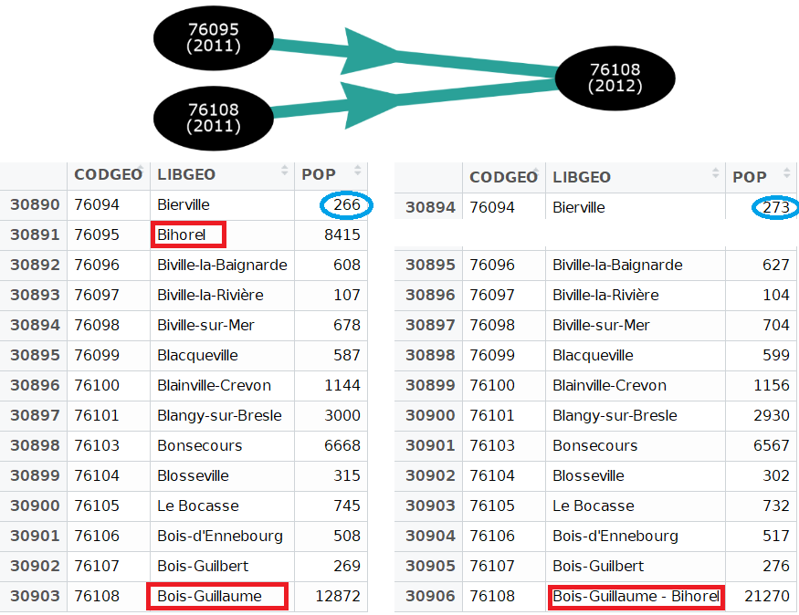</center>
Comment fait-on pour intégrer des données de plusieurs millésimes dans un même data.frame ?

&rarr; **Je dois  savoir transformer les pop2011 en COG2012 ou les pop2012 en COG2011** 
---
# Types de modifications communales (4/7)
- Variables numériques et fusions = **FACILE**
- *Question : Quelle situation pour la population (2011) en COG 2012 ?*
<center>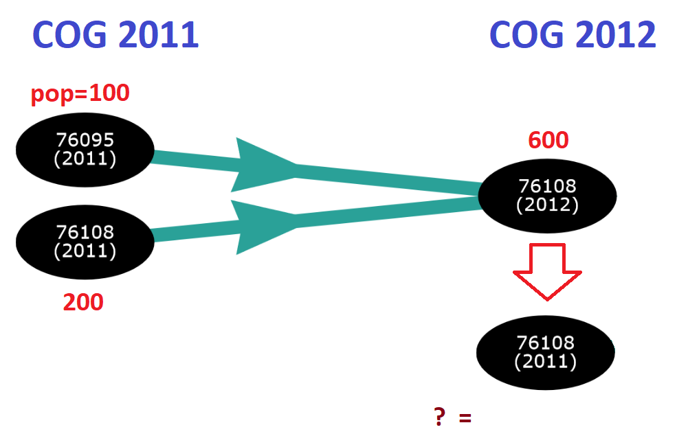</center>
---
# Types de modifications communales (4/7)
- Variables numériques et fusions = **FACILE**
- *Question : Quelle situation pour la population (2011) en COG 2012 ?*
<center>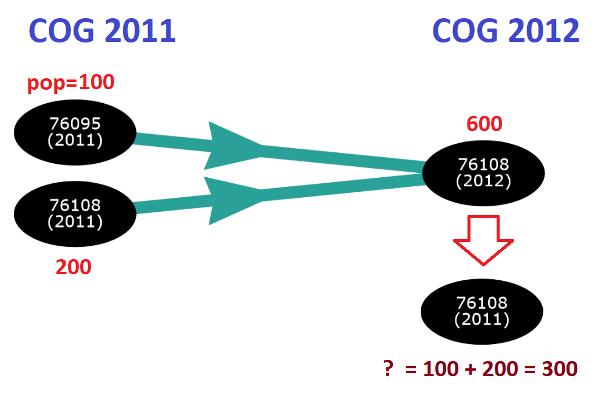</center>
---
# Types de modifications communales (5/7)
- Variables numériques et défusions = **DIFFICILE**
- *Question : Quelle situation pour la population (2013) en COG 2014 ?*
<center>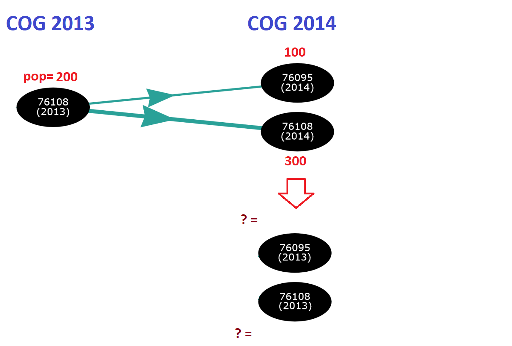</center>
---
# Types de modifications communales (5/7)
- Variables numériques et défusions = **DIFFICILE**
- *Question : Quelle situation pour la population (2013) en COG 2014 ?*
<center>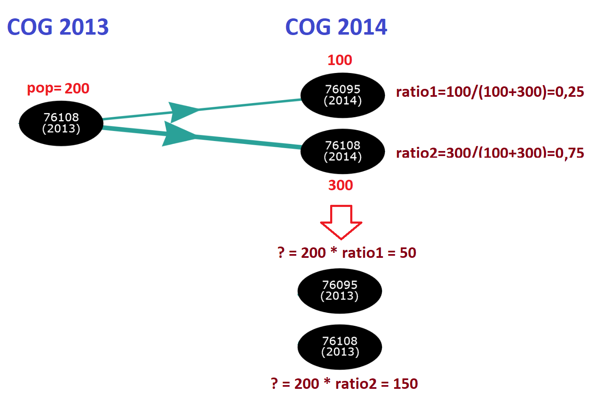</center>
---
# Types de modifications communales (6/7)
- Typologie et défusions = **FACILE**
- *Question : Quelles typologies pour les communes défusionnées en COG 2014 ?*
<center>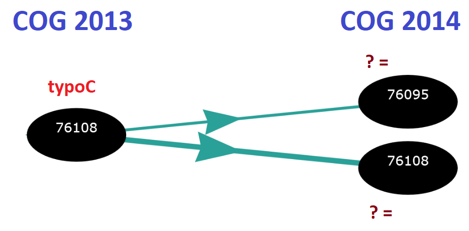</center>
---
# Types de modifications communales (6/7)
- Typologie et défusions = **FACILE**
- *Question : Quelles typologies pour les communes défusionnées en COG 2014 ?*
<center>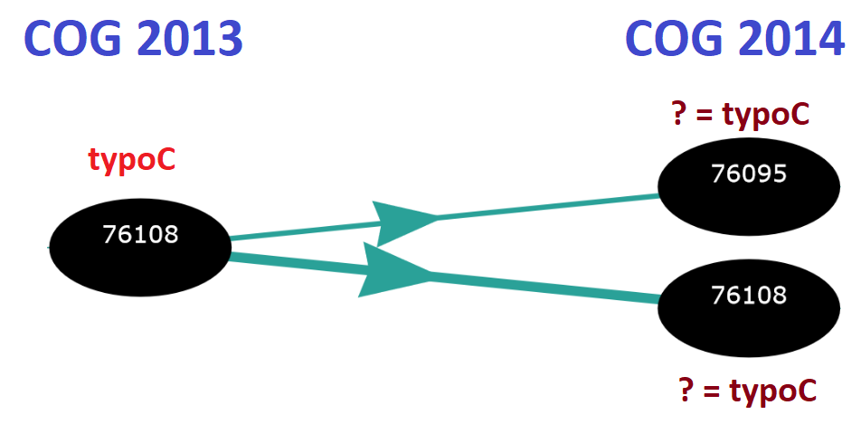</center>
---
# Types de modifications communales (7/7)
- Typologie et fusions = **DIFFICILE**
- *Question : Quelle typologie pour la commune fusionnée en COG 2012 ?*
<center>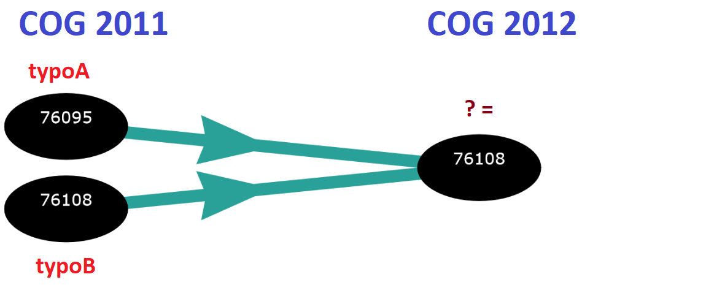</center>
---
# Types de modifications communales (7/7)
- Typologie et fusions = **DIFFICILE**
- *Question : Quelle typologie pour la commune fusionnée en COG 2012 ?*
<center>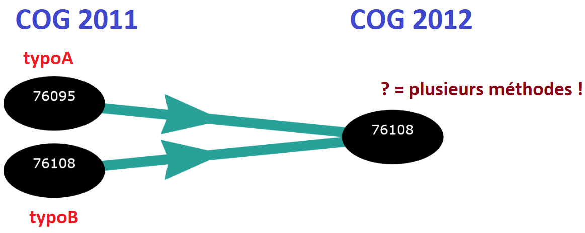</center>
---
# Les différents évènements depuis 1968
```{r comment='#', eval=TRUE, echo=F, warning=F, message=F}
library(tidyverse)
library(ggiraph)


evolution_communes <- data.frame(matrix(ncol=5,nrow=0)) %>% setNames(c("annee","nb_com","nb_f","nb_d","nb_c"))
annees <- c(1968,1975,1982,1990,1999,2008:2017)
for(i in 1:(length(annees))){
  evolution_communes <- evolution_communes %>% 
    add_row(
      "annee"=annees[i],
      "nb_com"=nrow(get(paste0("COG",annees[i]))),
      "nb_f"=ifelse(annees[i]!=2017,nrow(get(paste0("PASSAGE_",annees[i],"_",annees[i+1]))[which(get(paste0("PASSAGE_",annees[i],"_",annees[i+1]))[,"typemodif"]=="f"),]),NA),
      "nb_d"=ifelse(annees[i]!=2017,nrow(get(paste0("PASSAGE_",annees[i],"_",annees[i+1]))[which(get(paste0("PASSAGE_",annees[i],"_",annees[i+1]))[,"typemodif"]=="d"),]),NA),
      "nb_c"=ifelse(annees[i]!=2017,nrow(get(paste0("PASSAGE_",annees[i],"_",annees[i+1]))[which(get(paste0("PASSAGE_",annees[i],"_",annees[i+1]))[,"typemodif"]=="c"),]),NA)
    )
}
evolution_communes <- evolution_communes %>%
gather(key=evenement,nombre,-annee)  
  
graph_com1 <- 
ggplot(data=evolution_communes[which(evolution_communes$evenement=="nb_com"),]) +
geom_line(aes(x=annee,y=nombre,colour=evenement),linetype=1, size=1)+
geom_point_interactive(aes(x=annee,y=nombre,colour=evenement,tooltip=paste0(nombre,"<br><i>(",annee,"</i>)")), size=2)+
labs(y="Nombre de communes",x="Année")+
  scale_x_continuous(breaks=seq(1965,2017,by=5))+
scale_colour_manual(values="black")+
  theme(legend.position="none")

graph_com2 <- 
  ggplot(data=evolution_communes[which(evolution_communes$evenement!="nb_com"),]) +
  geom_point_interactive(aes(x=annee,y=nombre,colour=evenement,tooltip=paste0(nombre,"<br><i>(",annee,"</i>)")), size=2)+
  geom_line(aes(x=annee,y=nombre,colour=evenement),linetype=1, size=1)+
  labs(y="Nombre d'évènements",x="Année",colour="Type d'évènement")+
  scale_y_log10(breaks=c(10,100,500,1000))+
  scale_x_continuous(breaks=seq(1965,2017,by=5))+
  scale_colour_manual(values=viridis::viridis(3),breaks=c("nb_f","nb_d","nb_c"),labels=c("Fusions","Défusions","Changements\nde code"))+
  theme(legend.position = c(0.4, 0.8))

library(cowplot)
graph_com <- plot_grid(graph_com1, graph_com2, align="h", nrow=2)

ggiraph(code = {print(graph_com )}, height=5)
```
---
# Le package COGugaison (1/2)
- détecter le millésime du code officiel géographique d'une table de données communales : fonction **`COG_akinator`** et apparier une liste de communes d'une base de données avec celle du COG d'un millésime donné avec `apparier_COG`

- visualiser les modifications communales (fusions, défusions, changements de codes ou de noms) qui ont eu lieu entre deux dates : `modifications_communales`

- visualiser sur un graphique interactif la trajectoire d'une commune donnée, c'est-à-dire toutes les modifications qui ont eu lieu depuis 1968 : **`trajectoire_commune`** et `trajectoire_commune_shiny`  
- transformer des tables de données numériques en géographie au premier janvier d'une année souhaitée : **`changement_COG_varNum`**. 
---
# Le package COGugaison (2/2)
- transformer des typologies de communes en géographie au premier janvier d'une année souhaitée en ayant le choix entre plusieurs hypothèses de classement en cas de fusion de communes de classes différentes (attribuer une unique classe à toutes les communes fusionnées, attribuer la classe qui contient le plus de population, définir une classe absorbante, une classe absorbée ou une classe spécifique aux regroupements de plusieurs communes de classes différentes) : **`changement_COG_typo`**. Il est également possible d'isoler dans une table les communes fusionnées appartenant à des classes différentes : `changement_COG_typo_details`.

- permettre d'agréger les tables de données communales à de nombreux échelons supra-communaux administratifs (EPCI, arrondissements, cantons-villes, départements, régions) ou d'étude (bassins de vie, zones d'emploi, unités urbaines, aires urbaines) : **`nivsupra`**.

- gérer des cas particuliers comme les codes Insee des communes corses (`modification_Corse`) ou des arrondissements municipaux de Paris, Lyon, et Marseille (**`enlever_PLM`**) ou encore l'ancienne commune de l'Oudon (`modification_Oudon`)
---
# Les données utiles dans COGugaison (1/4)
> - COG

```{r, fig.show='hold'}
head(COG2017)
```
---
# Les données utiles dans COGugaison (2/4)
> - TABLES_PASSAGE

```{r, fig.show='hold'}
head(PASSAGE_2015_2016_insee)
```
---
# Les données utiles dans COGugaison (3/4)
```{r, fig.show='hold'}
head(table_supracom_2017)
```
---
# Les données utiles dans COGugaison (4/4)
```{r, fig.show='hold'}
head(libelles_supracom_2017)
```

---
# Exemple de fonction COGugaison (1/2)
<center></center>
**changement_COG_typo** : Transformer des typologies   
 -  `methode_classe_fusion` : pour toutes les communes qui ont fusionné entre 2 dates indiquer comme classe la valeur inscrite dans "mot_fusion" y compris pour les fusions de communes de mêmes classes
 - `methode_difference` : créer une classe spécifique dont le nom est contenu dans mot_difference [par défaut]
 - `methode_max_pop` : attribuer la classe contenant le maximum de population des communes fusionnées
 - `methode_classe_absorbante` : attribuer la classe dite absorbante à toute commune fusionnée contenant au moins une ancienne commune appartenant à cette classe absorbante
 - `methode_classe_absorbee` : ne pas tenir compte de cette classe dite "absorbée" pour toute commune fusionnée contenant au moins une ancienne commune appartenant à cette classe absorbée

---
# Exemple de fonction COGugaison (2/2)
```{r comment='#', eval=TRUE, echo=F, warning=F, message=F,include=FALSE}
library(sf)
comm_2017 <- st_read(paste0(getwd(),"/data/couches_geo/COM_2017_CARTElette.shp"), stringsAsFactors = FALSE) %>% 
  merge(.,table_supracom_2017[,-2],by.x="cod2017",by.y="CODGEO",all.x=T)
```
```{r, fig.show='hold'}
table_modif_com <- cbind(COG1968,COG1968[,1])[,c(1,4)] %>%
  setNames(c("CODGEO","typo"))
table_modif_com[1,]
table_modif_com <- changement_COG_typo(table_modif_com,
methode_fusion = "methode_classe_fusion",mot_fusion = "communes fusionnées",
annees=c(1968:2017),codgeo_entree = "CODGEO",typos="typo",donnees_insee = F)

table_modif_com$typo[table_modif_com$typo%in%(
  table_modif_com$typo[duplicated(table_modif_com$typo) & 
                         table_modif_com$typo!="communes fusionnées"])]<-
  "communes defusionnées"

table_modif_com$typo[which(!table_modif_com$typo%in%c("communes fusionnées",
"communes defusionnées"))] <- "communes inchangées"

table_modif_com[1,]
```
```{r comment='#', eval=TRUE, echo=F, warning=F, message=F}
comm_2017 <- merge(comm_2017,table_modif_com,by.x='cod2017',by.y='CODGEO',all.x=T,all.y=T) %>% 
  filter(typo!="communes inchangées")

theme_map2 <- function () 
{ 
  cowplot::theme_map() %+replace% 
    theme(
      legend.position=c(0.95,0.95), 
      legend.justification=c(0, 1), 
      legend.key.width=unit(1, "lines"), 
      legend.text=element_text(size=10),
      legend.title=element_text(size=11),
      panel.grid.major=element_line(color='transparent'),
      plot.title=element_text(size=12,face="bold"),
      plot.caption=element_text(size=10,colour = "grey20"),
      plot.margin = unit(c(0,0,0,0), "cm")
    ) 
}

```
---
# Modifications communales depuis 1968

```{r comment='#', eval=TRUE, echo=F, warning=F, message=F,include=FALSE}
p <- ggplot() +
  geom_sf(data = comm_2017, color = NA, aes(fill=typo)) +
  geom_sf(data=st_read(paste0(getwd(),"/data/couches_geo/REG_2016_CARTElette.shp"), stringsAsFactors = FALSE),color="black",fill=NA)+
  theme_map2() +
  theme(plot.margin = unit(c(1, 8, 0.5, 0.5), "lines"))+
  labs(fill="Évènement",
       caption =  "Source : Insee, COG 2017. Fond de carte antuki/CARTElette"
  ) +
  coord_sf(crs = st_crs(2154))
```
```{r comment='#', eval=TRUE, echo=F,fig.align="center",fig.width=12, fig.height=8}
p
```
---
background-image: url("img/fond_carte.png")
background-size: 100%

# Démarche

**Objectif** : Réaliser des cartes du nombre de femmes et nombre de femmes pour 100 hommes de 1968 à aujourd'hui

- Récupérer les données sur insee.fr et observer à quoi elles ressemblent

- Transformer les données (changements de COG + agrégation à une échelle supra-communale adaptée)

- Réaliser les cartes
---
background-image: url("img/giphy2.gif")
background-size: 100%
class: inverse, center, middle


# 1. Récupération des données

---
# Téléchargeons les données...
<center><a href="https://www.insee.fr/fr/statistiques/1893204" target="_self">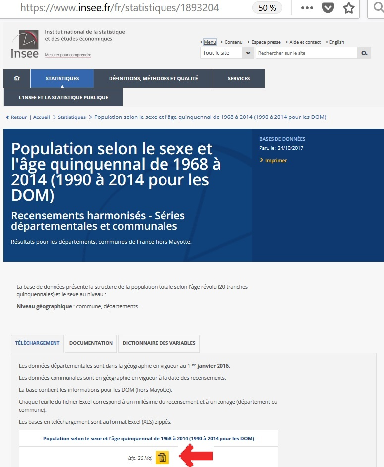</a></center>
---
# Observons à quoi elles ressemblent...
<center>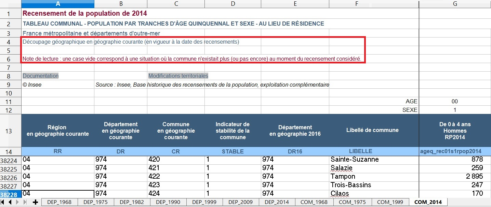</center>

---
# Chargement des tables com1968...com2014
```{r,warning=F, message=F}
library(readxl)

recup_bdd <- function(annee){
  bdd <- read_excel("data/pop-sexe-age-quinquennal6814.xls",
                    sheet = paste0("COM_",annee),
                    skip=13,col_names = TRUE, na = "")  %>% 
    mutate(codgeo=paste0(substr(DR,1,2),CR)) %>% 
    filter(!is.na(get(paste0("ageq_rec01s1rpop",annee)))) %>% 
    mutate(total_s1=rowSums(select(.,contains("s1"))), 
           total_s2=rowSums(select(.,contains("s2")))) %>%
    select(codgeo,total_s1,total_s2)
  return(bdd)
}
bdd_1975 <- recup_bdd(1975)
bdd_1999 <- recup_bdd(1999)
bdd_2014 <- recup_bdd(2014)
c(nrow(bdd_1975),nrow(bdd_1999),nrow(bdd_2014))
```
---
background-image: url("img/giphy3.gif")
background-size: 100%
class: inverse, center, middle

# 2. Transformation des données

---
# En quel COG sont les données ?
```{r comment='#', eval=TRUE, echo=T, warning=F, message=F}
COG_akinator(bdd_1975$codgeo,donnees_insee = T)
COG_akinator(bdd_1999$codgeo,donnees_insee = T)
COG_akinator(bdd_2014$codgeo,donnees_insee = T)
# REMARQUE :les recensements récents sont en COG n+2
```
---
# Changements de COG
```{r comment='#', eval=TRUE, echo=T, warning=F, message=F}
#Transformer les tables en bons COG
# idem pour bdd_1999 et bdd_2014
bdd_1975_COG2016 <- bdd_1975 %>%
  enlever_PLM(table_entree=.) %>% 
  changement_COG_varNum(.,c(1975:2016),donnees_insee = T)
```

```{r comment='#', eval=TRUE, echo=F, warning=F, message=F}
bdd_1999_COG2016 <- bdd_1999 %>%
  enlever_PLM(table_entree=.) %>% 
  changement_COG_varNum(.,c(1999:2016),donnees_insee = T)

bdd_2014_COG2016 <- bdd_2014 %>%
  enlever_PLM(table_entree=.) %>% 
  changement_COG_varNum(.,c(2016:2016),donnees_insee = T)
```

```{r comment='#', eval=TRUE, echo=T, warning=F, message=F}
#Fusionner les tables
bdd <- plyr::join_all(list(COG2016 %>% rename(codgeo=CODGEO) %>% select(-POP),
                           bdd_1975_COG2016,bdd_1999_COG2016,bdd_2014_COG2016),
                      type="left",by="codgeo") %>% 
setNames(nm=c("CODGEO","LIBGEO","total_s1_1975","total_s2_1975","total_s1_1999",
                "total_s2_1999","total_s1_2014","total_s2_2014"))
# vérifier les totaux. Par exemple... 
sum(bdd_2014$total_s1,na.rm = T)-sum(bdd$total_s1_2014,na.rm = T)
```
---
# Echelles géo supra-communales (1/2)

```{r comment='#', eval=TRUE, echo=F, warning=F, message=F}
color = grDevices::colors()[grep('gr(a|e)y', grDevices::colors(), invert = T)][-1]

carte_plot <- function(maille){
  couche <- st_read(paste0(getwd(),"/data/couches_geo/",maille,"_2016_CARTElette.shp"), stringsAsFactors = FALSE,quiet=T)
 carto <- ggplot() +
  geom_sf(data = couche, color = NA ,fill= sample(color, nrow(couche),replace=T)) +
   labs(
     title = paste0(maille," : ",nrow(couche)," entités")
    # ,caption = "Source : Insee, COG 2016. Fond de carte antuki/CARTElette à partir d'OSM 2015"
   ) +theme_map2() +
   theme(plot.margin = unit(c(0.5, 0.5, 0.5, 0.5), "lines"))+
   coord_sf(crs = st_crs(2154))
 return(carto)
}

```
```{r comment='#', eval=TRUE, echo=F, warning=F, message=F,fig.align="center"}
set.seed(3)
require(gridExtra)
grid.arrange(carte_plot("CV"),
           carte_plot("EPCI"),
           carte_plot("BV2012"),
           carte_plot("AU2010"),
            ncol=2
)
```
---
# Echelles géo supra-communales (2/2)

```{r comment='#', eval=TRUE, echo=F, warning=F, message=F,fig.align="center"}
set.seed(2)
grid.arrange(carte_plot("ARR"),
             carte_plot("ZE2010"),
             carte_plot("DEP"),
             carte_plot("REG"),
             ncol=2
)

```

---
# Agrégation par Zone d'Emploi

```{r comment='#', eval=TRUE, echo=T, warning=F, message=F}
bdd[1,]

bdd_ze <- bdd %>% 
  nivsupra(.,COG=2016,nivsupra="ZE2010") %>% 
  mutate(rapport_FH_1975=100*total_s2_1975/total_s1_1975,
         rapport_FH_1999=100*total_s2_1999/total_s1_1999,
         rapport_FH_2014=100*total_s2_2014/total_s1_2014
  )
```

---
background-image: url("img/giphy4.gif")
background-size: 100%
class: inverse, center, middle

# 3. Cartographie
---
# Format des couches cartographiques (1/3)
**Avant = spdf (SpatialPolygonsDataFrame)**
- {rgdal} : import/export des données et les opérations de projections
- {sp} :  gestion et l’affichage des données : *coordinates*, *SpatialPolygonsDataFrame*
- {rgeos} : géotraitements : *gUnion*, *gSimplify*, *gBuffer* 
- format : polygons*data.frame imbriqués dans des listes

**Maintenant = sf**
- un seul package : sf (nov. 2016) 
- auteur (Edzer Pebesma) = contributeur / maintainer des packages précédents
- format :   data.frame enrichi d’une «colonne-liste» de géométries
- avantage : format considéré plus pratique «tidy» et compatible avec >%>

---
# Format des couches cartographiques (2/3)
```{r comment='#', eval=TRUE, echo=T, warning=F, message=F}
library(rgdal)
```
```{r comment='#', eval=TRUE, echo=T, warning=F, message=F}
comm_2016 <-  readOGR(
  dsn = "data/couches_geo", 
  layer = "COM_2016_CARTElette", stringsAsFactors = FALSE,
  verbose=F
)
```
```{r comment='#', eval=TRUE, echo=T}
str(comm_2016)
```
---
# Format des couches cartographiques (3/3)
```{r comment='#', eval=TRUE, echo=T, warning=F, message=F}
library(sf)
```
```{r comment='#', eval=TRUE, echo=T, warning=F, message=F}
comm_2016 <- st_read(paste0(getwd(),"/data/couches_geo/COM_2016_CARTElette.shp"),
                     stringsAsFactors = FALSE,quiet=T) 
```
```{r comment='#', eval=TRUE, echo=T}
str(comm_2016)
```
---
# Créer des couches supra-communales (1/2)
<center>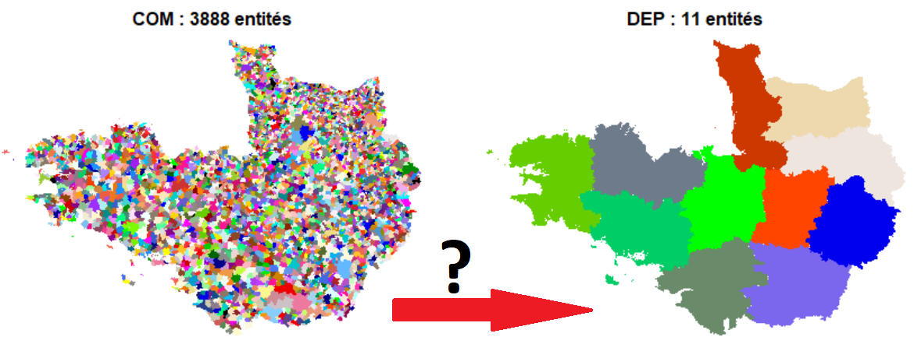</center>
---
# Créer des couches supra-communales (2/2)
```{r comment='#', eval=F, echo=T, warning=F, message=F,results='hide'}
# chargement de la couche comm_2016
comm_2016 <- st_read(paste0(getwd(),"/data/couches_geo/COM_2016_CARTElette.shp"),
                     stringsAsFactors = FALSE) %>% 
  merge(.,table_supracom_2016[,-2],by.x="insee",by.y="CODGEO",all.x=T)


# fonction pour créer les couches supra-communales
creer_couche <- function(maille){
  couche <- comm_2016 %>% dplyr::select(maille) %>%
    group_by(get(maille))  %>% summarize() %>%
    setNames(nm=c(maille,colnames(.)[-1])) %>%
    st_simplify( preserveTopology = FALSE, dTolerance = 10)
  st_write(couche, paste0(getwd(), "/data/couches_geo/",maille,
                          "_2016_CARTElette.shp"))
}

# appliquer la fonction
for(maille in c("DEP","REG","CV","EPCI","ZE2010",
                "AU2010","BV2012","ARR","UU2010")){
  creer_couche(maille)
}
```
---
# Cartes avec cartography (1/4)

```{r comment='#', eval=T, echo=F, warning=F, message=F, include=F}
library(cartography)

couche_ze <- st_read(paste0(getwd(),"/data/couches_geo/ZE2010_2016_CARTElette.shp"), stringsAsFactors = FALSE) %>% 
  merge(.,bdd_ze,by="ZE2010",all.x=T)

cartography_rapportHF <- function(annee, breaks, col){

  par(mar=c(1,1,1,1))
  
  choroLayer(x = couche_ze, #sf data
             var =  paste0("rapport_FH_",annee), # var in df
             breaks = breaks, # list of breaks
             col = col, # colors 
             border = "black", # color of the polygons borders
             legend.pos = "topleft", # position of the legend
             legend.title.txt = paste0("Nombre de femmes pour\n100 hommes en ",
                                       annee), # title of the legend
             legend.values.rnd = 0, # number of decimal in the legend values
             colNA = "#303030", #color of NA values
             add = FALSE) # add the layer to the current plot
  
 propSymbolsLayer(x = couche_ze,
                   var = paste0("total_s2_",annee),  # population
                   symbols = "circle", # type of symbol
                   border = "grey", # color of the symbols borders
                   col= NA,
                   lwd = 2, # width of the symbols borders
                   legend.pos = "left",
                   legend.title.txt = paste0("Nombre de\nfemmes en ",annee))
  layoutLayer(title = paste0("Répartition des femmes en France en ", annee),
              sources = paste0("Insee, RP",annee,". Fond antuki/CARTElette"),
              author = "antuki with cartography",
              scale = 0, #automatic scale bar 
              north=TRUE,
              frame = TRUE,
              coltitle = "black", #color of the title
              col = "#688994" # color of the frame
 ) 
  
}
```
```{r comment='#', eval=F, echo=T, warning=F, message=F}
couche_ze <- st_read(paste0(getwd(),
                            "/data/couches_geo/ZE2010_2016_CARTElette.shp"),
                     stringsAsFactors = F) %>% 
  merge(.,bdd_ze,by="ZE2010",all.x=T)

library(cartography)

cartography_rapportHF <- function(annee, breaks, col){

par(mar=c(1,1,1,1))
  
  choroLayer(x = couche_ze, #sf data
             var =  paste0("rapport_FH_",annee), # var in df
             breaks = breaks, # list of breaks
             col = col, # colors 
             border = "black", # color of the polygons borders
             legend.pos = "topleft", # position of the legend
             legend.title.txt = paste0("Nombre de femmes pour\n100 hommes en ",
                                       annee), # title of the legend
             legend.values.rnd = 0, # number of decimal in the legend values
             colNA = "#303030", #color of NA values
             add = FALSE) # add the layer to the current plot

```
---
# Cartes avec cartography (2/4)
```{r comment='#', eval=F, echo=T, warning=F, message=F}
 propSymbolsLayer(x = couche_ze,
                   var = paste0("total_s2_",annee),  # population
                   symbols = "circle", # type of symbol
                   border = "grey", # color of the symbols borders
                   col= NA,
                   lwd = 2, # width of the symbols borders
                   legend.pos = "left",
                   legend.title.txt = paste0("Nombre de\nfemmes en ",annee))
  layoutLayer(title = paste0("Répartition des femmes en France en ", annee),
              sources = paste0("Insee, RP",annee,". Fond antuki/CARTElette"),
              author = "antuki with cartography",
              scale = 0, #automatic scale bar 
              north=TRUE,
              frame = TRUE,
              coltitle = "black", #color of the title
              col = "#688994" # color of the frame
 )

}
```
---
# Cartes avec cartography (3/4)
```{r comment='#', eval=F, echo=T, warning=F, message=F}
cartography_rapportHF(annee=2014,
                      breaks=quantile(couche_ze$rapport_FH_2014,seq(0,1,0.20),
                      na.rm=T) %>% replace(2,100),
                      col=carto.pal(pal1 = "blue.pal", n1 = 1, pal2 = "red.pal", 
                      n2 = 4))
```
---
# Cartes avec cartography (4/4)
```{r comment='#', eval=T, echo=F, warning=F, message=F,fig.align="center"}
cartography_rapportHF(annee=2014,
                      breaks=quantile(couche_ze$rapport_FH_2014,seq(0,1,0.20),
                      na.rm=T) %>% replace(2,100),
                      col=carto.pal(pal1 = "blue.pal", n1 = 1, pal2 = "red.pal", 
                      n2 = 4))
```
---
# Cartes avec ggplot2 (1/4)
```{r comment='#', eval=F, echo=T, warning=F, message=F}
#créer thème personnalisé
theme_map2 <- function () 
{ 
  cowplot::theme_map() %+replace% 
    theme(
      legend.position=c(0.95,0.95), 
      legend.justification=c(0, 1), 
      legend.key.width=unit(1, "lines"), 
      legend.text=element_text(size=10),
      legend.title=element_text(size=11),
      panel.grid.major=element_line(color='transparent'),
      plot.title=element_text(size=12,face="bold"),
      plot.caption=element_text(size=10,colour = "grey20"),
      plot.margin = unit(c(0,0,0,0), "cm")
    ) 
}
```

---
# Cartes avec ggplot2 (2/4)
```{r comment='#', eval=T, echo=T, warning=F, message=F}
ggplot2_rapportHF <- function(annee,breaks,col){
  carto <- ggplot(
    bind_cols(couche_ze %>%  mutate(typo= cut(get(paste0("rapport_FH_",annee)),
              breaks=breaks,dig.lab=4,include.lowest=T)),
              couche_ze %>% st_centroid() %>% st_coordinates() %>%
                as.data.frame()
  )) +
    geom_sf(aes(fill= typo), color="black") +
    geom_point(aes(x=X,
                   y=Y,
                   size= with(couche_ze,get(paste0("total_s2_",annee)))),
               shape=1,fill=NA,color="grey",stroke = 1.5) +
    scale_size(name=paste0("Nombre de\nfemmes en ",annee), range = c(0,18),
               breaks=c(50000,100000,500000),labels=c("50 000","100 000",
                                                      "500 000"))+ 
    scale_fill_manual(name=paste0("Nombre de femmes pour\n100 hommes en ",annee),
                      values=col, na.value="#303030")+
    theme_map2() +
    labs(
      title = paste0("Répartition des femmes en France en ", annee),
      caption = paste0("Insee, RP",annee,". Fond antuki/CARTElette")
    )  + guides(size= guide_legend(order=1))
  return(carto)
}
```
---
# Cartes avec ggplot2 (3/4)
```{r comment='#', eval=F, echo=T, warning=F, message=F}
ggplot2_rapportHF(annee=2014,
                  breaks=quantile(couche_ze$rapport_FH_2014,
                                  seq(0,1,0.20), na.rm=T) %>% replace(2,100),
                  col=carto.pal(pal1 = "blue.pal", n1 = 1, pal2 = "red.pal",
                                n2 = 4)
                  )
```
---
# Cartes avec ggplot2 (4/4)
```{r comment='#', eval=T, echo=F, warning=F, message=F,fig.align="center",fig.width=12,fig.height=8}
ggplot2_rapportHF(annee=2014,
                  breaks=quantile(couche_ze$rapport_FH_2014,
                                  seq(0,1,0.20), na.rm=T) %>% replace(2,100),
                  col=carto.pal(pal1 = "blue.pal", n1 = 1, pal2 = "red.pal", n2 = 4)
                  )
```
---
# Cartes animées avec magick (1/2)
```{r comment='#', eval=F, echo=T, warning=F, message=F}
library(magick)
img <- image_graph(800, 500, res = 96)

out <- lapply(c(1975,1999,2014), function(annee){
  p <- ggplot2_rapportHF(annee=annee,
                      breaks=quantile(c(couche_ze$rapport_FH_1975,
  couche_ze$rapport_FH_1999,couche_ze$rapport_FH_2014),seq(0,1,0.20), na.rm=T)
                      %>% replace(2,100),
                      col=carto.pal(pal1 = "blue.pal", n1 = 1, pal2 = "red.pal",
                                    n2 = 4)
    )
 print(p)
})

animation <- image_animate(img, fps = 0.5)
print(animation)
image_write(animation, "carte_animee.gif")
```
---
# Cartes animées avec magick (2/2)
<center>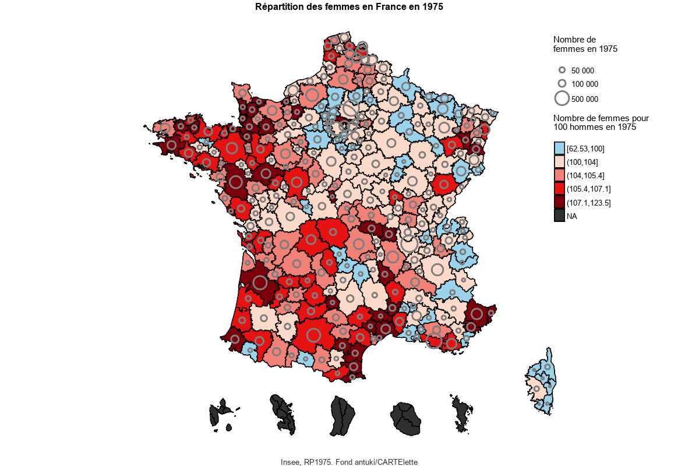</center>
---
# Cartes interactives avec ggiraph (1/4)
```{r comment='#', eval=F, echo=T, warning=F, message=F}
library(rgdal)
library(ggiraph)

couche_ze_rgdal <- 
  merge(
    fortify(
      readOGR(
        dsn = "data/couches_geo", 
        layer = "ZE2010_2016_CARTElette", stringsAsFactors = FALSE
      ), region="ZE2010"), 
    bdd_ze, by.x="id",by.y="ZE2010",all.x=T) 

couche_ze_rgdal<-  couche_ze_rgdal %>% 
  mutate(typo= cut(get(paste0("rapport_FH_",2014)),
                   breaks=quantile(couche_ze$rapport_FH_2014,
                                   seq(0,1,0.20), na.rm=T) %>%
                     replace(2,100),dig.lab=4,include.lowest=T))
```
```{r comment='#', eval=T, echo=F, warning=F, message=F,include=F}
library(rgdal)
library(ggiraph)

couche_ze_rgdal <- 
  merge(
    fortify(
      rgeos::gBuffer(
      readOGR(
        dsn = "data/couches_geo", 
        layer = "ZE2010_2016_CARTElette", stringsAsFactors = FALSE
      ),width=0,byid=T),
      region="ZE2010")
     , 
    bdd_ze, by.x="id",by.y="ZE2010",all.x=T) 

couche_ze_rgdal<-  couche_ze_rgdal %>% 
  mutate(typo= cut(get(paste0("rapport_FH_",2014)),
                   breaks=quantile(couche_ze$rapport_FH_2014,
                                   seq(0,1,0.20), na.rm=T) %>%
                     replace(2,100),dig.lab=4,include.lowest=T))
```
---
# Cartes interactives avec ggiraph (2/4)
```{r comment='#', eval=T, echo=T, warning=F, message=F,fig.align="center"}
ggiraph_rapportHF <- function(annee,breaks,col){
  
  carto <- ggplot(couche_ze_rgdal,aes(x=long,y=lat)) +
    geom_map_interactive(map = couche_ze_rgdal,
                         mapping=aes(map_id=id,tooltip=paste0("Ratio : ",
    round(get(paste0("rapport_FH_",annee)),0)), fill=typo),color=NA) +
    coord_fixed()+
    scale_fill_manual(name=paste0("Nombre de femmes pour\n100 hommes en ",annee)
                      ,values=col, na.value="#303030")+
    cowplot::theme_map()+
    labs(
      title = paste0("Répartition des femmes en France en ", annee),
      caption = paste0("Insee, RP",annee,". Fond antuki/CARTElette")
    ) 
  
  ggiraph(code = {print(carto)},
          tooltip_extra_css = "background-color:black;color:white;font-style:
          italic;padding:10px;border-radius:10px 20px 10px 20px;",
          tooltip_opacity = .75,width=0.9,width_svg=8,height_svg = 6)
}
```
---
# Cartes interactives avec ggiraph (3/4)
```{r comment='#', eval=F, echo=T, warning=F, message=F}
ggiraph_rapportHF(annee=2014,
                  breaks=quantile(couche_ze$rapport_FH_2014,seq(0,1,0.20),
                                  na.rm=T) %>% replace(2,100),
                  col=carto.pal(pal1 = "blue.pal", n1 = 1, pal2 = "red.pal",
                                n2 = 4))

```
---
# Cartes interactives avec ggiraph (4/4)
```{r comment='#', eval=T, echo=F, warning=F, message=F,fig.align="center",fig.width=10}
ggiraph_rapportHF(annee=2014,breaks=quantile(couche_ze$rapport_FH_2014,seq(0,1,0.20), na.rm=T) %>% replace(2,100),col=carto.pal(pal1 = "blue.pal", n1 = 1, pal2 = "red.pal", n2 = 4))

```
---
# Cartes interactives avec leaflet (1/3)
```{r comment='#', eval=T, echo=F, warning=F, message=F}
library(leaflet)
leaflet_rapportHF <- function(){
  carto <- leaflet(bind_cols(couche_ze,
                    couche_ze %>%  st_centroid() %>% 
                    st_transform(., '+proj=longlat +ellps=GRS80 +no_defs') %>%
                    st_coordinates() %>% as.data.frame()) %>%
                     filter(!substr(ZE2010,1,2)%in%c("01","02","03","04"))) %>%
    addTiles('http://{s}.tile.openstreetmap.org/{z}/{x}/{y}.png') %>%
    addCircles(lng = ~X, lat = ~Y, weight = 1,
               radius = ~sqrt(total_s2_2014)*50,
               popup = ~paste(nom," : ", round(total_s2_2014,0)),
               color = ~colorQuantile(carto.pal(pal1 = "blue.pal",
                       n1 = 1, pal2 = "red.pal", n2 = 4),
                      domain=couche_ze$rapport_FH_2014, n = 5)
                      (rapport_FH_2014),
               fillOpacity = 0.7) %>% 
    addLegend("topright", 
              colors = carto.pal(pal1 = "blue.pal", n1 = 1,  pal2 = "red.pal",
                                 n2 = 4),
              labels = paste0("[",round(quantile(couche_ze$rapport_FH_2014,
              seq(0,1,0.20),na.rm=T),1),";",c(round(quantile(
              couche_ze$rapport_FH_2014,seq(0,1,0.20),na.rm=T),1)[-1],NA),")")[-6],
              title = "Nombre de<br>femmes pour<br>100 hommes<br>en 2014",
              opacity = 1) 
  
  return(carto)
  
}
```
```{r comment='#', eval=F, echo=T, warning=F, message=F}
library(leaflet)

leaflet_rapportHF <- function(){
  carto <- leaflet(bind_cols(couche_ze,
                    couche_ze %>%  st_centroid() %>% 
                    st_transform(., '+proj=longlat +ellps=GRS80 +no_defs') %>%
                    st_coordinates() %>% as.data.frame()) %>%
                     filter(!substr(ZE2010,1,2)%in%c("01","02","03","04"))) %>%
    addTiles('http://{s}.tile.openstreetmap.org/{z}/{x}/{y}.png') %>%
    addCircles(lng = ~X, lat = ~Y, weight = 1,
               radius = ~sqrt(total_s2_2014)*50,
               popup = ~paste(nom," : ", round(total_s2_2014,0)),
               color = ~colorQuantile(carto.pal(pal1 = "blue.pal",
                       n1 = 1, pal2 = "red.pal", n2 = 4),
                      domain=couche_ze$rapport_FH_2014, n = 5)
                      (rapport_FH_2014),
               fillOpacity = 0.7) 
```
---
# Cartes interactives avec leaflet (2/3)
```{r comment='#', eval=F, echo=T, warning=F, message=F}
carto <- carto %>% 
  addLegend("topright", 
            colors = carto.pal(pal1 = "blue.pal", n1 = 1,  pal2 = "red.pal",
                               n2 = 4),
            labels = paste0("[",round(quantile(couche_ze$rapport_FH_2014,
            seq(0,1,0.20),na.rm=T),1),";",c(round(quantile(
            couche_ze$rapport_FH_2014,seq(0,1,0.20),na.rm=T),1)[-1],NA),")")[-6],
            title = "Nombre de<br>femmes pour<br>100 hommes<br>en 2014",
            opacity = 1) 
  
  return(carto)
  
}
```

---
# Cartes interactives avec leaflet (3/3)
```{r comment='#', eval=T, echo=F, warning=F, message=F}
leaflet_rapportHF()
```
---
class: center, middle

<center></center>

<link rel="stylesheet" href="https://cdnjs.cloudflare.com/ajax/libs/font-awesome/4.7.0/css/font-awesome.min.css">

<a href="http://twitter.com/antuki13" class="social"><i class="fa fa-twitter fa-2x" title="Mon twitter"></i>@antuki13</a>
<a href="http://github.com/antuki" class="social"><i class="fa fa-github fa-2x" title="Mon github"></i>antuki</a>
<a href="http://antuki.github.io" class="social"><i class="fa fa-bold fa-2x" title="Mon blog"></i>antuki.github.io</a>

Diaporama créé avec le package R [**xaringan**](https://github.com/yihui/xaringan) avec le thème [rladies](https://alison.rbind.io/post/r-ladies-slides/)  
et quelques gifs rigolos de [giphy](https://giphy.com/).

Avec également l'utilisation de [remark.js](https://remarkjs.com), [knitr](http://yihui.name/knitr), et [R Markdown](https://rmarkdown.rstudio.com).

