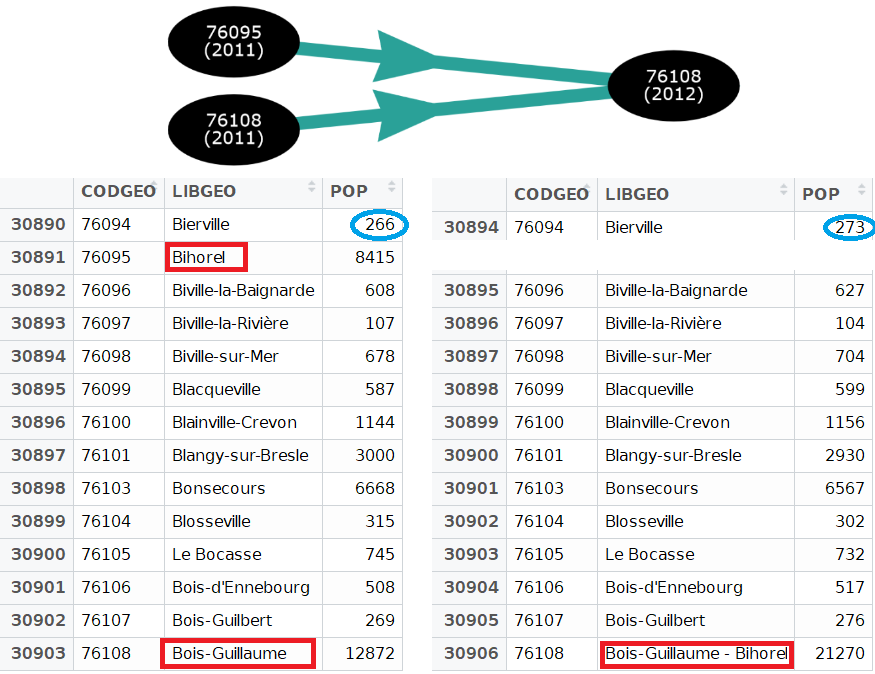
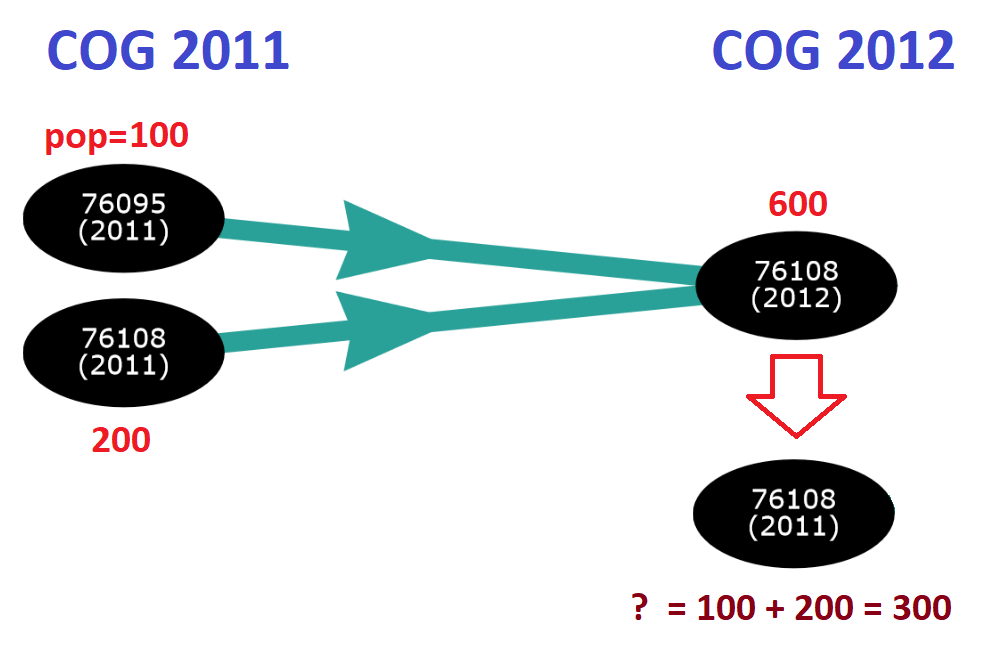
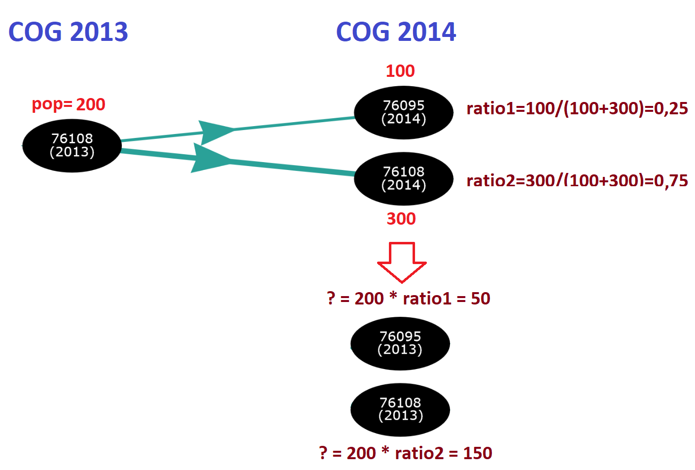
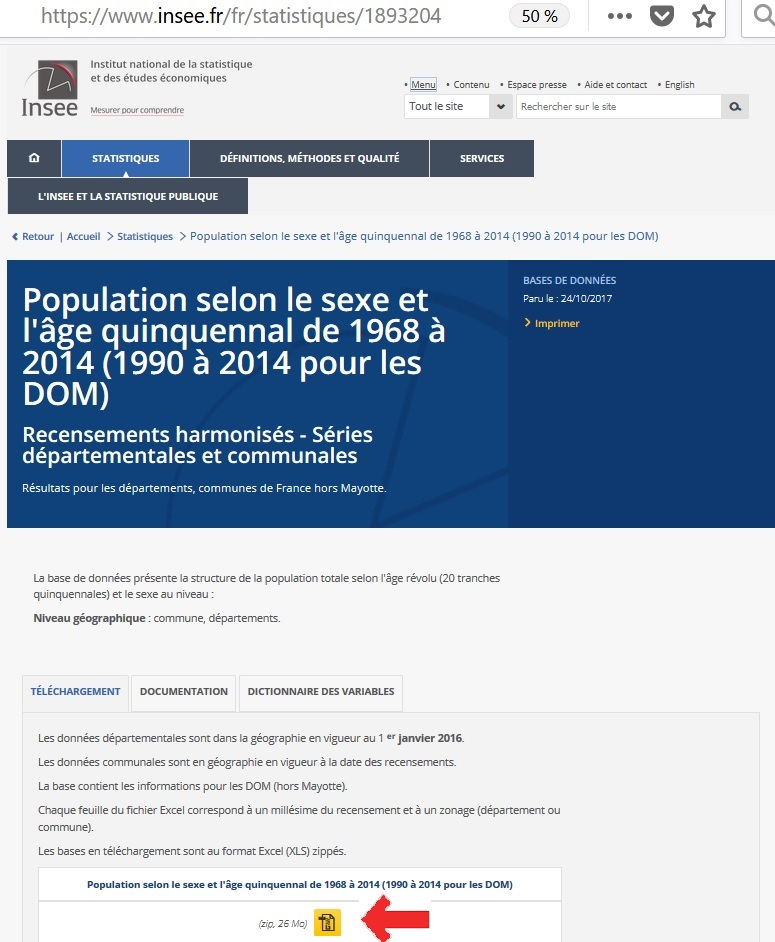
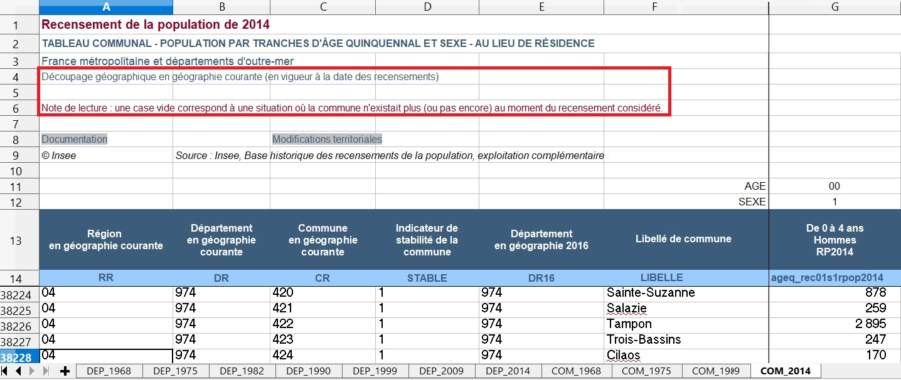
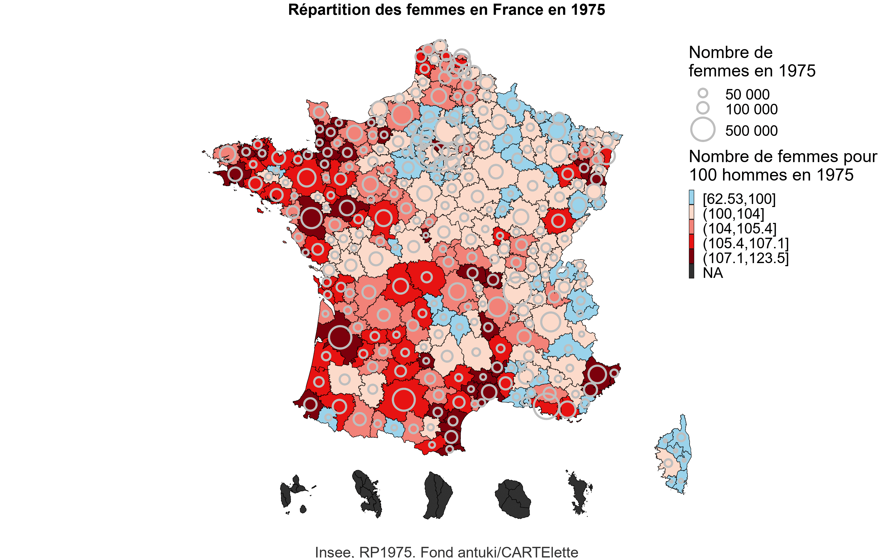
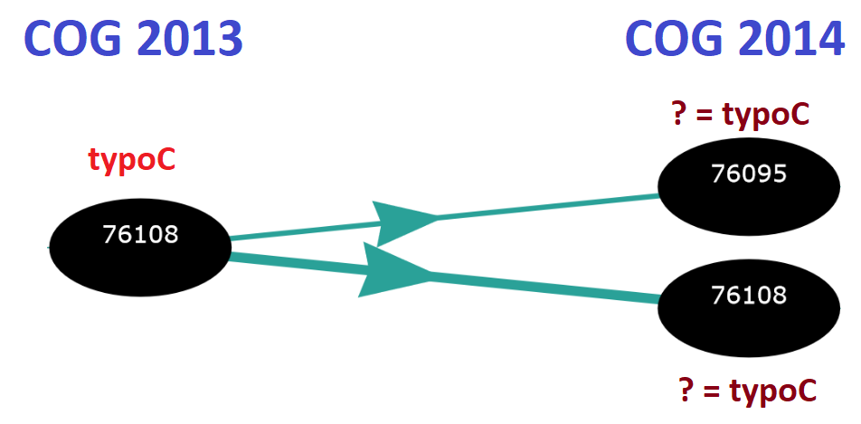
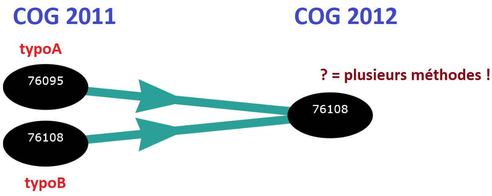

```{r setup, include=FALSE}
options(htmltools.dir.version = FALSE)
knitr::opts_chunk$set(dev = "svg", cache = FALSE)
```

background-size: 100%
class: inverse, center, middle

# 1. Introduction sur les géographies communales
---
# Code Officiel Géographique (COG)
Le **Code officiel géographique** (COG) est un document de référence publié par l’**Insee** qui rassemble les **codifications (numérotations et libellés) des communes**, des cantons, des arrondissements, des départements, des régions...


Ce code est **révisé annuellement**, en fonction notamment des **fusions et associations** de communes ou de territoires, des **défusions** et des **changements de dénomination**.
---
# Types de modifications communales (1/5)
```{r comment='#', eval=TRUE, echo=F, warning=F, message=F}
library(COGugaison)
trajectoire_commune("76108", 2014,donnees_insee=FALSE)
```
---
# Types de modifications communales (2/5)
```{r comment='#', eval=TRUE, echo=F, warning=F, message=F}
library(COGugaison)
trajectoire_commune("14697", 2013,donnees_insee=FALSE)
```
---
# Types de modifications communales (3/5)
- les indicateurs varient d'une année sur l'autre pour une même commune
- la liste des communes change chaque année
<center></center>
Comment fait-on pour rassembler dans un unique data.frame des données produites à des millésimes différents ?

--

&rarr; **Je dois (au choix) savoir transformer les pop2011 en COG2012 ou les pop2012 en COG2011** 
---
# Types de modifications communales (4/5)
- Variables numériques et fusions = **FACILE**
- *Question : Quelle situation pour la population (2011) en COG 2012 ?*
<center></center>
---
# Types de modifications communales (5/5)
- Variables numériques et défusions = **DIFFICILE**
- *Question : Quelle situation pour la population (2013) en COG 2014 ?*
<center></center>

```{r comment='#', eval=F, echo=F, warning=F, message=F}
# Conclusion !


Contrairement à ce que l'on pourrait croire, le code commune n'est pas un identifiant unique. 

<center>C'est le croisement </br>
<font size="20"><b>CODE COMMUNE x MILLESIME</b></font> </br>
qui est <b>unique</b> ! 
</center>

&rarr; Il faut alors toujours se poser la question du millésime de la donnée géographique avant de la croiser avec d'autres données ou de la représenter sur une carte.
```

---
# Les différents évènements depuis 1968
```{r comment='#', eval=TRUE, echo=F, warning=F, message=F}
library(tidyverse)
library(ggiraph)

evolution_communes <- data.frame(matrix(ncol=5,nrow=0)) %>% setNames(c("annee","nb_com","nb_f","nb_d","nb_c"))
annees <- c(1968,1975,1982,1990,1999,2008:2018)
for(i in 1:(length(annees))){
  evolution_communes <- evolution_communes %>% 
    add_row(
      "annee"=annees[i],
      "nb_com"=nrow(get(paste0("COG",annees[i]))),
      "nb_f"=ifelse(annees[i]!=2018,nrow(get(paste0("PASSAGE_",annees[i],"_",annees[i+1]))[which(get(paste0("PASSAGE_",annees[i],"_",annees[i+1]))[,"typemodif"]=="f"),]),NA),
      "nb_d"=ifelse(annees[i]!=2018,nrow(get(paste0("PASSAGE_",annees[i],"_",annees[i+1]))[which(get(paste0("PASSAGE_",annees[i],"_",annees[i+1]))[,"typemodif"]=="d"),]),NA),
      "nb_c"=ifelse(annees[i]!=2018,nrow(get(paste0("PASSAGE_",annees[i],"_",annees[i+1]))[which(get(paste0("PASSAGE_",annees[i],"_",annees[i+1]))[,"typemodif"]=="c"),]),NA)
    )
}
evolution_communes <- evolution_communes %>%
gather(key=evenement,nombre,-annee)  
  
graph_com1 <- 
ggplot(data=evolution_communes[which(evolution_communes$evenement=="nb_com"),]) +
geom_line(aes(x=annee,y=nombre,colour=evenement),linetype=1, size=1)+
geom_point_interactive(aes(x=annee,y=nombre,colour=evenement,tooltip=paste0(nombre,"<br><i>(",annee,"</i>)")), size=2)+
labs(y="Nombre de communes",x="Année")+
  scale_x_continuous(breaks=seq(1965,2018,by=5))+
scale_colour_manual(values="black")+
  theme(legend.position="none")

graph_com2 <- 
  ggplot(data=evolution_communes[which(evolution_communes$evenement!="nb_com"),]) +
  geom_point_interactive(aes(x=annee,y=nombre,colour=evenement,tooltip=paste0(nombre,"<br><i>(",annee,"</i>)")), size=2)+
  geom_line(aes(x=annee,y=nombre,colour=evenement),linetype=1, size=1)+
  labs(y="Nombre d'évènements",x="Année",colour="Type d'évènement")+
  scale_y_log10(breaks=c(10,100,500,1000))+
  scale_x_continuous(breaks=seq(1965,2018,by=5))+
  scale_colour_manual(values=viridis::viridis(3),breaks=c("nb_f","nb_d","nb_c"),labels=c("Fusions","Défusions","Changements\nde code"))+
  theme(legend.position = c(0.4, 0.8))

library(cowplot)
graph_com <- plot_grid(graph_com1, graph_com2, align="h", nrow=2)

ggiraph(code = {print(graph_com )}, height=5)
```


---
background-size: 100%
class: inverse, center, middle

# 2. Le package COGugaison
---

# Les fonctions de COGugaison (1/2)
- détecter le millésime du code officiel géographique d'une table de données communales : fonction **`COG_akinator`** et apparier une liste de communes d'une base de données avec celle du COG d'un millésime donné avec `apparier_COG`  

--

- visualiser les modifications communales (fusions, défusions, changements de codes ou de noms) qui ont eu lieu entre deux dates : `modifications_communales`

--

- visualiser sur un graphique interactif la trajectoire d'une commune donnée, c'est-à-dire toutes les modifications qui ont eu lieu depuis 1968 : **`trajectoire_commune`** et `trajectoire_commune_shiny` 

--

- transformer des tables de données numériques en géographie au premier janvier d'une année souhaitée : **`changement_COG_varNum`** 
---
# Les fonctions de COGugaison (2/2)
- transformer des typologies de communes en géographie au premier janvier d'une année souhaitée en ayant le choix entre plusieurs hypothèses de classement en cas de fusion de communes de classes différentes (attribuer une unique classe à toutes les communes fusionnées, attribuer la classe qui contient le plus de population, définir une classe absorbante, une classe absorbée ou une classe spécifique aux regroupements de plusieurs communes de classes différentes) : **`changement_COG_typo`**. Il est également possible d'isoler dans une table les communes fusionnées appartenant à des classes différentes : `changement_COG_typo_details`

--

- permettre d'agréger les tables de données communales à de nombreux échelons supra-communaux administratifs (EPCI, arrondissements, cantons-villes, départements, régions) ou d'étude (bassins de vie, zones d'emploi, unités urbaines, aires urbaines) : **`nivsupra`**

--

- gérer des cas particuliers comme les codes Insee des communes corses (`modification_Corse`) ou des arrondissements municipaux de Paris, Lyon, et Marseille (**`enlever_PLM`**) ou encore l'ancienne commune de l'Oudon (`modification_Oudon`)
---
background-size: 100%
class: inverse, center, middle

# 3. Exemple 
## Cartographier l'évolution du nombre de femmes et d'hommes par zone d'emploi de 1968 à aujourd'hui
---
background-image: url("img/fond_carte.png")
background-size: 100%

# Démarche

**Objectif** : Réaliser des cartes du nombre de femmes et nombre de femmes pour 100 hommes de 1968 à aujourd'hui

- Récupérer les données sur insee.fr et observer à quoi elles ressemblent

- Transformer les données (changements de COG + agrégation à une échelle supra-communale adaptée)

- Réaliser les cartes

---
# Téléchargeons les données...
<center><a href="https://www.insee.fr/fr/statistiques/1893204" target="_self"></a></center>
---
# Observons à quoi elles ressemblent...
<center></center>

---
# Chargement des tables com1968...com2014
```{r,warning=F, message=F}
library(readxl)

recup_bdd <- function(annee) {
  bdd <- read_excel("data/pop-sexe-age-quinquennal6814.xlsx", 
    sheet = paste0("COM_", annee), skip = 13, col_names = TRUE, 
    na = "") %>%
    mutate(codgeo = paste0(substr(DR, 1, 2), CR)) %>%
    filter(!is.na(get(paste0("ageq_rec01s1rpop", annee)))) %>%
    mutate(total_s1 = rowSums(select(., contains("s1"))), 
    total_s2 = rowSums(select(., contains("s2")))) %>%
    select(codgeo, total_s1, total_s2)
  return(bdd)
}


```

--

```{r,warning=F, message=F}
bdd_1975 <- recup_bdd(1975)
bdd_1999 <- recup_bdd(1999)
bdd_2014 <- recup_bdd(2014)
c(nrow(bdd_1975), nrow(bdd_1999), nrow(bdd_2014))
```
---
# En quel COG sont les données ?
```{r comment='#', eval=TRUE, echo=T, warning=F, message=F}
COG_akinator(bdd_1975$codgeo, donnees_insee = TRUE)
COG_akinator(bdd_1999$codgeo, donnees_insee = TRUE)
COG_akinator(bdd_2014$codgeo, donnees_insee = TRUE)
# REMARQUE :les recensements récents sont en COG n+2
```
---
# Changements de COG
```{r comment='#', eval=TRUE, echo=T, warning=F, message=F}
# Transformer les tables en bons COG
# idem pour bdd_1999 et bdd_2014
bdd_1975_COG2016 <- bdd_1975 %>%
  enlever_PLM() %>% 
  changement_COG_varNum(1975:2016, donnees_insee = TRUE)
```

```{r comment='#', eval=TRUE, echo=F, warning=F, message=F}
bdd_1999_COG2016 <- bdd_1999 %>%
  enlever_PLM() %>% 
  changement_COG_varNum(1999:2016,donnees_insee = T)

bdd_2014_COG2016 <- bdd_2014 %>%
  enlever_PLM() %>% 
  changement_COG_varNum(c(2016:2016),donnees_insee = T)
```

--

```{r comment='#', eval=TRUE, echo=T, warning=F, message=F}
# Fusionner les tables
bdd <- plyr::join_all(list(COG2016 %>% rename(codgeo = CODGEO) %>% 
              select(-POP), bdd_1975_COG2016, bdd_1999_COG2016,
              bdd_2014_COG2016), type = "left", by = "codgeo") %>%
  setNames(nm = c("CODGEO", "LIBGEO", "total_s1_1975",
                  "total_s2_1975", "total_s1_1999", "total_s2_1999",
                  "total_s1_2014", "total_s2_2014"))
```

--

```{r comment='#', eval=TRUE, echo=T, warning=F, message=F}
# vérifier les totaux. Par exemple...
sum(bdd_2014$total_s1, na.rm = TRUE) - sum(bdd$total_s1_2014, na.rm = TRUE)
```
---
# Agrégation par Zone d'Emploi

```{r comment='#', eval=TRUE, echo=T, warning=F, message=F}
bdd[1, ]

bdd_ze <- bdd %>%
  nivsupra(COG = 2016, nivsupra = "ZE2010") %>% 
  mutate(rapport_FH_1975 = 100 * total_s2_1975/total_s1_1975, 
    rapport_FH_1999 = 100 * total_s2_1999/total_s1_1999, 
    rapport_FH_2014 = 100 * total_s2_2014/total_s1_2014)
```

---
# Aperçu du résultat (code en annexe)
<center></center>

---

class: center, middle

<center></center>

<link rel="stylesheet" href="https://cdnjs.cloudflare.com/ajax/libs/font-awesome/4.7.0/css/font-awesome.min.css">

<a href="http://twitter.com/antuki13" class="social"><i class="fa fa-twitter fa-2x" title="Mon twitter"></i>@antuki13</a>
<a href="http://github.com/antuki" class="social"><i class="fa fa-github fa-2x" title="Mon github"></i>antuki</a>
<a href="http://antuki.github.io" class="social"><i class="fa fa-bold fa-2x" title="Mon blog"></i>antuki.github.io</a>


**Voir aussi : [antuki/CARTElette](https://github.com/antuki/CARTElette) pour la création de couches cartographiques à partir du COG et des couches IGN.**

Diaporama créé avec le package R [**xaringan**](https://github.com/yihui/xaringan) avec le thème [rladies](https://alison.rbind.io/post/r-ladies-slides/).

Avec également l'utilisation de [remark.js](https://remarkjs.com), [knitr](http://yihui.name/knitr), et [R Markdown](https://rmarkdown.rstudio.com).

---
background-size: 100%
class: inverse, center, middle, annexe
count: false


# Annexes 
---
class: annexe
count: false

# Les données utiles dans COGugaison (1/4)
> - COG

```{r, fig.show='hold'}
head(COG2017)
```

---
class: annexe
count: false

# Les données utiles dans COGugaison (2/4)
> - TABLES_PASSAGE

```{r, fig.show='hold'}
head(PASSAGE_2015_2016_insee)
```
---
class: annexe
count: false

# Les données utiles dans COGugaison (3/4)
```{r, fig.show='hold'}
head(table_supracom_2017)
```
---
class: annexe
count: false

# Les données utiles dans COGugaison (4/4)
```{r, fig.show='hold'}
head(libelles_supracom_2017)
```
---
class: annexe
count: false

# Cartes (1/6)

```{r comment='#', eval=T, echo=T, warning=F, message=F}
# Créer thème personnalisé
theme_map2 <- function() {
  cowplot::theme_map() %+replace%
    theme(legend.position = c(0.95, 0.95),
          legend.justification = c(0, 1),
          legend.key.width = unit(1, "lines"),
          legend.text = element_text(size = 10),
          legend.title = element_text(size = 11), 
          panel.grid.major = element_line(color = "transparent"), 
          plot.title = element_text(size = 12, face = "bold"), 
          plot.caption = element_text(size = 10, colour = "grey20"), 
          plot.margin = unit(c(0, 0, 0, 0), "cm"))
}
```

--

```{r comment='#', eval=T, echo=T, warning=F, message=F}
# Charger la couche cartographique et la fusionner avec les données
library(sf)
couche_ze <- st_read("data/couches_geo/ZE2010_2016_CARTElette.shp",
                     stringsAsFactors = FALSE, quiet = TRUE) %>% 
  merge(bdd_ze,by="ZE2010",all.x = TRUE)
```
---
class: annexe
count: false

# Cartes (2/6)
```{r comment='#', eval=T, echo=T, warning=F, message=F}
ggplot2_rapportHF <- function(annee, breaks, col){
  carto <- ggplot(couche_ze %>%  mutate(typo = cut(get(paste0("rapport_FH_",
                                                              annee)),
              breaks = breaks, dig.lab = 4, include.lowest = TRUE))
) +
    geom_sf(aes(fill = typo), color = "black") +
    geom_point(data=couche_ze %>% st_centroid() %>% st_coordinates() %>%
                as.data.frame(),
               aes(x = X, y = Y,
                   size= with(couche_ze, get(paste0("total_s2_", annee)))),
               shape = 1, fill = NA, color = "grey", stroke = 1.5) +
    scale_size(name = paste0("Nombre de\nfemmes en ", annee), range = c(0, 18),
               breaks = c(50000, 100000, 500000),labels = c("50 000", "100 000",
                                                      "500 000"))+ 
    scale_fill_manual(name = paste0("Nombre de femmes pour\n100 hommes en ",
                                    annee),
                      values = col, na.value = "#303030")+
    theme_map2() +
    labs(
      title = paste0("Répartition des femmes en France en ", annee),
      caption = paste0("Insee, RP", annee, ". Fond antuki/CARTElette")
    )  + guides(size = guide_legend(order = 1))
  return(carto)
}
```
---
class: annexe
count: false

# Cartes (3/6)
```{r comment='#', eval=F, echo=T, warning=F, message=F}
ggplot2_rapportHF(annee = 2014,
                      breaks = quantile(couche_ze$rapport_FH_2014, 
                                        seq(0, 1, 0.2), na.rm = TRUE) %>%
                        replace(2, 100),
                      col = cartography::carto.pal(pal1 = "blue.pal", 
                                      n1 = 1,
                                      pal2 = "red.pal",
                                      n2 = 4))
```
---
class: annexe
count: false

# Cartes (4/6)
```{r comment='#', eval=T, echo=F, warning=F, message=F,fig.align="center",fig.width=12,fig.height=8}
ggplot2_rapportHF(annee=2014,
                  breaks=quantile(couche_ze$rapport_FH_2014,
                                  seq(0,1,0.20), na.rm=T) %>% replace(2,100),
                  col=cartography::carto.pal(pal1 = "blue.pal", n1 = 1, pal2 = "red.pal", n2 = 4)
                  )
```
---
class: annexe
count: false

# Cartes (5/6)
```{r comment='#', eval=F, echo=T, warning=F, message=F}
library(magick)

img <- image_graph(3200, 2000, res = 96)

out <- lapply(c(1975, 1999, 2014), function(annee) {
  p <- ggplot2_rapportHF(annee = annee,
                         breaks = quantile(c(couche_ze$rapport_FH_1975, 
    couche_ze$rapport_FH_1999, couche_ze$rapport_FH_2014), 
    seq(0, 1, 0.2), na.rm = TRUE) %>% replace(2, 100),
    col = cartography::carto.pal(pal1 = "blue.pal", 
    n1 = 1, pal2 = "red.pal", n2 = 4))
  print(p)
})

animation <- image_animate(img, fps = 0.5)
print(animation)
image_write(animation, "carte_animee.gif")
```
---
class: annexe
count: false

# Cartes (6/6)
<center></center>

---
class: annexe
count: false
background-image: url("img/fond_carte2.png")
background-size: 100%

# Modifs communales depuis 1968 (1/6)

**Objectif** : Réaliser une carte des communes ayant subi des modifications communales (fusions / défusions) depuis 1968

- Créer un data.frame contenant la liste des codes communes de 1968 ainsi qu'une autre colonne appelée "typo" contenant les mêmes informations

- Transformer le data.frame en géographie au 01/01/2018 grâce à la fonction `changement_COG_typo` en recodant en trois modalités la variable "typo" : communes inchangées, communes fusionnées et communes défusionnées

- Observer le résultat de cette typologie ainsi créée sur une carte

---
class: annexe
count: false

# Modifs communales depuis 1968 (2/6)
- Typologie et défusions = **FACILE**
- *Question : Quelles typologies pour les communes défusionnées en COG 2014 ?*
<center></center>
---
class: annexe
count: false

# Modifs communales depuis 1968 (3/6)
- Typologie et fusions = **DIFFICILE**
- *Question : Quelle typologie pour la commune fusionnée en COG 2012 ?*
<center></center>
---
class: annexe
count: false

# Modifs communales depuis 1968 (4/6)
<center></center>
**changement_COG_typo** : Transformer des typologies   
 -  `methode_classe_fusion` : pour toutes les communes qui ont fusionné entre 2 dates indiquer comme classe la valeur inscrite dans "mot_fusion" y compris pour les fusions de communes de mêmes classes
--

 - `methode_difference` : créer une classe spécifique dont le nom est contenu dans mot_difference (par défaut)
--
 
 - `methode_max_pop` : attribuer la classe contenant le maximum de population des communes fusionnées
--
 
 - `methode_classe_absorbante` : attribuer la classe dite absorbante à toute commune fusionnée contenant au moins une ancienne commune appartenant à cette classe absorbante
--
 
 - `methode_classe_absorbee` : ne pas tenir compte de cette classe dite "absorbée" pour toute commune fusionnée contenant au moins une ancienne commune appartenant à cette classe absorbée

---
class: annexe
count: false

# Modifs communales depuis 1968 (5/6)
```{r comment='#', eval=TRUE, echo=F, warning=F, message=F,include=FALSE}
library(sf)
comm_2017 <- st_read(paste0(getwd(),"/data/couches_geo/COM_2017_CARTElette.shp"), stringsAsFactors = FALSE) %>% 
  merge(table_supracom_2017[,-2],by.x="cod2017",by.y="CODGEO",all.x = T)
```
```{r, fig.show='hold'}
table_modif_com <- cbind(COG1968, COG1968[, 1])[, c(1,4)] %>%
  setNames(c("CODGEO", "typo"))
table_modif_com[1, ]
```
--

```{r, fig.show='hold'}
table_modif_com <- changement_COG_typo(table_modif_com,
methode_fusion = "methode_classe_fusion", mot_fusion = "communes fusionnées",
annees = 1968:2018, codgeo_entree = "CODGEO", typos = "typo", donnees_insee = F)
```
--

```{r, fig.show='hold'}
table_modif_com$typo[table_modif_com$typo %in% (
  table_modif_com$typo[duplicated(table_modif_com$typo) & 
                         table_modif_com$typo != "communes fusionnées"])] <-
  "communes défusionnées"

table_modif_com$typo[which(!table_modif_com$typo %in% c("communes fusionnées", 
"communes défusionnées"))] <- "communes inchangées"

table_modif_com[1, ]
```
```{r comment='#', eval=TRUE, echo=F, warning=F, message=F}
comm_2017 <- merge(comm_2017, table_modif_com, by.x = 'cod2017', by.y = 'CODGEO', all.x = T, all.y=T) %>% 
  filter(typo!="communes inchangées")

theme_map2 <- function() {
  cowplot::theme_map() %+replace%
    theme(legend.position = c(0.95, 0.95),
          legend.justification = c(0, 1),
          legend.key.width = unit(1, "lines"),
          legend.text = element_text(size = 10),
          legend.title = element_text(size = 11), 
          panel.grid.major = element_line(color = "transparent"), 
          plot.title = element_text(size = 12, face = "bold"), 
          plot.caption = element_text(size = 10, colour = "grey20"), 
          plot.margin = unit(c(0, 0, 0, 0), "cm"))
}

```
---
class: annexe
count: false

# Modifs communales depuis 1968 (6/6)

```{r comment='#', eval=TRUE, echo=F, warning=F, message=F,include=FALSE}
library(sf)
p <- ggplot() +
  geom_sf(data = comm_2017, color = NA, aes(fill=typo)) +
  geom_sf(data=st_read(paste0(getwd(),"/data/couches_geo/REG_2016_CARTElette.shp"), stringsAsFactors = FALSE),color="black",fill=NA)+
  theme(plot.margin = unit(c(1, 8, 0.5, 0.5), "lines"))+
  theme_map2() +
  labs(fill="Évènement",
       caption =  "Source : Insee, COG 2017. Fond de carte antuki/CARTElette"
  ) +
  coord_sf(crs = st_crs(2154))
```
```{r comment='#', eval=TRUE, echo=F,fig.align="center",fig.width=12, fig.height=8}
p
```
