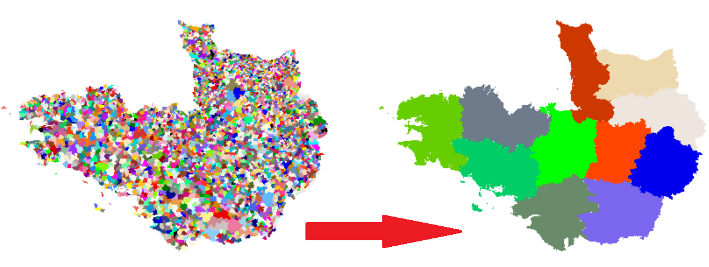

```{r setup, include=FALSE}
options(htmltools.dir.version = FALSE)
#knitr::opts_chunk$set(dev = "svg", cache = FALSE)
```

```{r wrap-hook, include=FALSE}
library(knitr)
hook_output = knit_hooks$get('output')
knit_hooks$set(output = function(x, options) {
  # this hook is used only when the linewidth option is not NULL
  if (!is.null(n <- options$linewidth)) {
    x = knitr:::split_lines(x)
    # any lines wider than n should be wrapped
    if (any(nchar(x) > n)) x = strwrap(x, width = n)
    x = paste(x, collapse = '\n')
  }
  hook_output(x, options)
})
```

## Administrative divisions... 

.left-column[
</img>

]
.right-column[
<center>The French territorial « mille-feuille »</center></br>
<center></center>
]

---
## ... change over time
<center></center>


```{r include=FALSE}
library(readxl)
library(dplyr)
recup_bdd <- function(annee) {
  bdd <- read_excel("data/pop-sexe-age-quinquennal6814.xlsx", 
    sheet = paste0("COM_", annee), skip = 13, col_names = TRUE, 
    na = "") %>%
    mutate(codgeo = paste0(substr(DR, 1, 2), CR)) %>%
    filter(!is.na(get(paste0("ageq_rec01s1rpop", annee)))) %>%
    mutate(total_s1 = rowSums(select(., contains("s1"))), 
    total_s2 = rowSums(select(., contains("s2")))) %>%
    select(codgeo, total_s1, total_s2) %>% 
    rename(code=codgeo,men=total_s1, women=total_s2)
  return(bdd)
}
library(COGugaison)
db <- recup_bdd(2014) %>% enlever_PLM 
```

---
.pull-left[
### See modifications over the years
]

.pull-right[
 <center></center>
]

```{r include=FALSE}
trajectoire_commune("76108", 2014) #see also trajectoire_commune_shiny
evol <- modifications_communales(date_debut="01-01-2011",date_fin="01-01-2014")
cat(grep("(76095)|(76108)",strsplit(evol$fusions,"\n",fixed=TRUE)[[1]],value=TRUE))
cat(grep("(76095)|(76108)",strsplit(evol$defusions,"\n",fixed=TRUE)[[1]],value=TRUE))
```

`r icon::fa_exclamation_triangle(size=1,border=FALSE,color="red")` All functions and parameters are translated from French for this presentation

```{r eval=FALSE}
municipality_evolution_graph(code = "76108", year = 2014) # uses {visNetwork}
```

<center></center>

```{r eval=FALSE}
evol <- municipalities_evolutions(begin_date="01-01-2011", end_date="01-01-2014")
```

```{r linewidth=90, eval=FALSE}
grep("(76095)|(76108)", evol$mergers, value = TRUE)
```

```{r linewidth=90, echo=FALSE}
cat("2012-01-01: Bois-Guillaume-Bihorel (76108) is a merger of Bihorel (76095), Bois-Guillaume (76108).")
```

```{r linewidth=90, eval=FALSE}
grep("(76095)|(76108)", evol$divisions, value = TRUE)
```

```{r linewidth=90, echo=FALSE}
cat("2014-01-01: Bois-Guillaume (76108) divided into Bois-Guillaume (76108), Bihorel
(76095).")
```

---

.pull-left[
### Guess the year of a database
]

.pull-right[
<center></center>
]

```{r}
head(db, 2)
```

```{r eval=FALSE}
OGC_guess(db$code) # guesses the year of the Official Geographic Code (OGC)
```

```{r include=FALSE}
COG_akinator(db$code)
```

```{r echo=FALSE}
print("2016")
```

```{r eval=FALSE}
codes <- c("99086", db$code[-1]) # creates a vector of ID of municipalities
merge_OGC(codes = codes, OGC = 2016)$not_in_db # ID not in the db
```

```{r echo=FALSE}
codes <- c("99086",db$code[-1]) # creates a vector of ID of municipalities
cat(apparier_COG(vecteur_codgeo = codes,COG = 2016,donnees_insee = F)$absent_de_bdd[1]) 
```

```{r eval=FALSE}
merge_OGC(codes = codes, OGC = 2016)$not_in_OGC # ID not in the OGC
```

```{r echo=FALSE}
cat(apparier_COG(vecteur_codgeo = codes,COG = 2015,donnees_insee = F)$absent_de_COG[1])
```

---
.pull-left[
### Change the year of a database

* **qualitative variable** [character]</br> 
`r icon::fa_hand_point_right(size=1,border=FALSE,color="#562457")` See `change_OGC_typology`

    + *divisions * `r icon::fa_caret_right(size=1,border=FALSE,color="#88398A")` easy: copy the lines
    + *mergers * `r icon::fa_caret_right(size=1,border=FALSE,color="#88398A")` several hypotheses: assign the class that contains the most population, define an absorbent or absorbed class...
]

.pull-right[
 <center></center>

    
* **quantitative variable** [numeric]</br>
`r icon::fa_hand_point_right(size=1,border=FALSE,color="#562457")` See `change_OGC_numeric` 

    + *mergers * `r icon::fa_caret_right(size=1,border=FALSE,color="#88398A")` easy: sum the lines 
    + *divisions * `r icon::fa_caret_right(size=1,border=FALSE,color="#88398A")` divide lines proportionally to population

]
    
```{r}
nrow(db)
```

```{r eval=FALSE}
db_2019 <- db %>% # changes the year of a numeric variable (from 2016 to 2019)
  change_OGC_numeric(2016:2019)
```

```{r echo=FALSE}
db_2019 <- db %>% # changes the year of a numeric variable (from 2016 to 2019)
  changement_COG_varNum(2016:2019)
```

```{r}
str(db_2019)
```
---
.pull-left[
### Aggregate a database
]

.pull-right[
<center></center>
]


```{r eval=FALSE}
db_dep <- db_2019 %>% # aggregates the database (municipalities -> départements)
  aggregate_OGC(OGC = 2019, administrative_division = "DEP")
```

```{r echo=FALSE}
db_dep <- db_2019 %>% # aggregates the database (municipalities -> départements)
  nivsupra(COG = 2019, nivsupra = "DEP")
```

```{r}
str(db_dep)
```

```{r eval = FALSE}
DEP_sf <- left_join(DEP_sf,db_dep,by=c("DEP"="DEP")) %>%
  mutate(prop=100*men/(men+women))
plot(DEP_sf %>% select(prop))
```

<center></center>

---

## Future improvements? 

* **Create new functions**
    +  add your own geographical levels
    +  add your own distribution keys
    
* **Expand to other countries**
    +  in Europe : Nomenclature of Territorial Units for Statistics (NUTS)
    +  identify common functionnalities VS local (French!) specificities

* **Reach non R-users**
    +  Shiny Apps
    +  API

---

class: center, middle

<center></center>

<link rel="stylesheet" href="https://cdnjs.cloudflare.com/ajax/libs/font-awesome/4.7.0/css/font-awesome.min.css">

<a href="http://twitter.com/antuki13" class="social"><i class="fa fa-twitter fa-2x" title="Mon twitter"></i>@antuki13</a>
<a href="http://github.com/antuki" class="social"><i class="fa fa-github fa-2x" title="Mon github"></i>antuki</a>
<a href="http://antuki.github.io" class="social"><i class="fa fa-bold fa-2x" title="Mon blog"></i>antuki.github.io</a>


**Packages on github: [antuki/COGugaison](https://github.com/antuki/COGugaison) and [antuki/CARTElette](https://github.com/antuki/CARTElette).**

Slides created with R package [**xaringan**](https://github.com/yihui/xaringan) with the [R-Ladies theme](https://alison.rbind.io/post/r-ladies-slides/).

Also with [remark.js](https://remarkjs.com), [knitr](http://yihui.name/knitr), and [R Markdown](https://rmarkdown.rstudio.com). 
